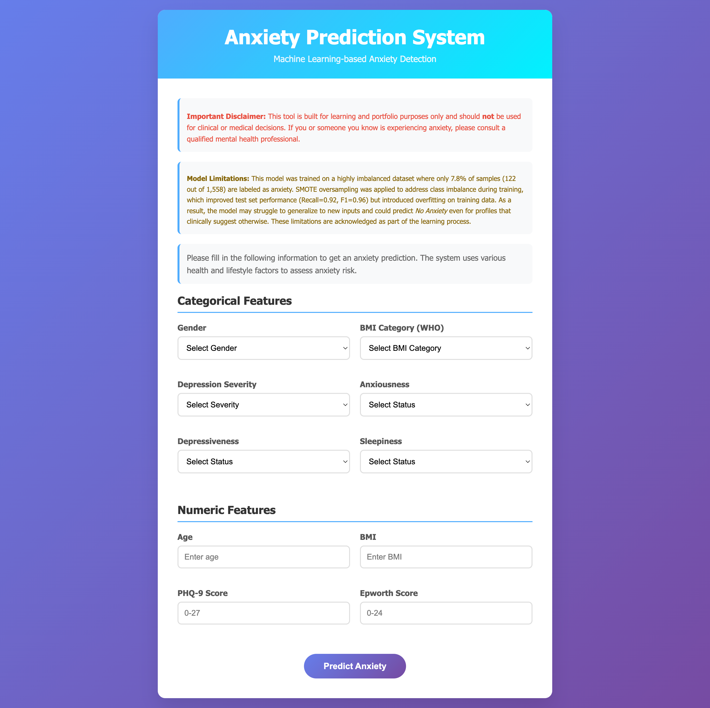

# Anxiety Prediction Machine Learning System

> **⚠️ Important Disclaimer:** Only README.md and index.html are AI-generated otherwise it is manually written.

A comprehensive machine learning system for predicting anxiety disorders based on various health and lifestyle factors. This project includes data preprocessing, model training, evaluation, and a web interface for real-time predictions.

## 📄 License

This project is licensed under the MIT License - see the details below:

```
MIT License

Copyright (c) 2026 [Your Name]

Permission is hereby granted, free of charge, to any person obtaining a copy
of this software and associated documentation files (the "Software"), to deal
in the Software without restriction, including without limitation the rights
to use, copy, modify, merge, publish, distribute, sublicense, and/or sell
copies of the Software, and to permit persons to whom the Software is
furnished to do so, subject to the following conditions:

The above copyright notice and this permission notice shall be included in all
copies or substantial portions of the Software.

THE SOFTWARE IS PROVIDED "AS IS", WITHOUT WARRANTY OF ANY KIND, EXPRESS OR
IMPLIED, INCLUDING BUT NOT LIMITED TO THE WARRANTIES OF MERCHANTABILITY,
FITNESS FOR A PARTICULAR PURPOSE AND NONINFRINGEMENT. IN NO EVENT SHALL THE
AUTHORS OR COPYRIGHT HOLDERS BE LIABLE FOR ANY CLAIM, DAMAGES OR OTHER
LIABILITY, WHETHER IN AN ACTION OF CONTRACT, TORT OR OTHERWISE, ARISING FROM,
OUT OF OR IN CONNECTION WITH THE SOFTWARE OR THE USE OR OTHER DEALINGS IN THE
SOFTWARE.
```

## 🎯 Project Overview

This system uses machine learning algorithms to analyze patient data and predict the likelihood of anxiety disorders. It includes:

- **Data preprocessing and feature engineering**
- **Multiple ML model comparison and evaluation**
- **Web-based prediction interface**
- **Comprehensive visualization and analysis**

## 📁 Project Structure

```
AnxietyPredictionMachineLearning/
├── data/                   # Dataset storage
├── models/                 # Trained model files
├── templates/              # HTML templates for web interface
│   ├── index.html         # Main web interface
│   └── images/            # Static images and visualizations
├── analysis/              # Analysis results and metrics
├── images/                # Generated plots and visualizations
├── train.py              # Model training script
├── web.py                # Flask web application
├── requirements.txt      # Python dependencies
├── .env.example          # Environment variables template
└── README.md             # This file
```

## 🚀 Quick Start

### Prerequisites

- Python 3.8+
- pip package manager

### Installation

1. Clone the repository:
```bash
git clone <repository-url>
cd AnxietyPredictionMachineLearning
```

2. Create a virtual environment:
```bash
python -m venv venv
source venv/bin/activate  # On Windows: venv\Scripts\activate
```

3. Install dependencies:
```bash
pip install -r requirements.txt
```

4. Set up environment variables:
```bash
cp .env.example .env
# Edit .env with your preferred settings
```

### Usage

1. **Train the model:**
```bash
python train.py
```

2. **Run the web application:**
```bash
python web.py
```

3. **Access the web interface:**
Open your browser and navigate to `http://localhost:8080`

## 📊 Features and Components

### 1. Training Pipeline (`train.py`)

The training script performs comprehensive data analysis and model training:

**Data Preprocessing:**
- Handles missing values using mode for categorical and median for numerical features
- One-hot encoding for categorical variables
- Standard scaling for numerical features
- Feature selection using Chi-square tests

**Feature Engineering:**
- **Categorical Features:** gender, who_bmi, depression_severity, anxiousness, depressiveness, sleepiness
- **Numerical Features:** age, bmi, phq_score, epworth_score
- **Dropped Features:** anxiety_treatment, anxiety_severity, depression_treatment, depression_diagnosis, suicidal (post-diagnosis features)

**Model Comparison:**
- Logistic Regression
- Support Vector Classifier (SVC)
- SGD Classifier
- Random Forest Classifier
- Calibrated Random Forest
- XGBoost Classifier

**Evaluation Metrics:**
- Stratified K-Fold Cross-Validation (5-fold)
- F1 Score, Precision, Recall
- ROC-AUC analysis
- Confusion Matrix visualization
- Feature importance analysis

**Class Imbalance Handling:**
- SMOTE (Synthetic Minority Over-sampling Technique) for balancing the dataset
- Custom threshold optimization
- Risk level classification (Low/Medium/High)

**Generated Outputs:**
- Trained model pickle files
- Feature importance plots
- Correlation heatmaps
- ROC curves
- Confusion matrices
- Analysis CSV reports

### 2. Web Application (`web.py`)

Flask-based web interface for real-time predictions:

**Key Features:**
- RESTful API endpoint `/predict` for model inference
- Preprocessing pipeline integration
- Probability-based risk assessment
- JSON response format with detailed predictions

**API Response:**
```json
{
    "prediction": 1,
    "probability": 0.85,
    "prediction_label": "Anxiety Detected",
    "confidence": "85.00%",
    "risk_level": "High"
}
```

### 3. Web Interface (`templates/index.html`)

Modern, responsive web interface with:



**Design Features:**
- Gradient-based modern UI design
- Responsive grid layout
- Interactive form validation
- Real-time prediction results
- Loading states and animations

**Input Fields:**
- **Categorical:** Gender, BMI Category, Depression Severity, Anxiousness, Depressiveness, Sleepiness
- **Numerical:** Age, BMI, PHQ-9 Score, Epworth Score

**Risk Assessment:**
- Three-tier risk classification (Low/Medium/High)
- Probability-based confidence scores
- Color-coded result display

**Important Disclaimers:**
- Educational purpose disclaimer
- Model limitations transparency
- Clinical use warning

## 📈 Model Performance

### Dataset Characteristics
- **Total Samples:** 1,558
- **Anxiety Cases:** 122 (7.8%)
- **Non-Anxiety Cases:** 1,436 (92.2%)
- **Highly Imbalanced Dataset**
- **Source:** [Kaggle Anxiety Dataset](https://www.kaggle.com/datasets/mahmoudosama22/anxiety-dataset)

### Best Model Performance
- **Model:** Calibrated Random Forest Classifier
- **Test Set Recall:** 0.92
- **Test Set F1 Score:** 0.96
- **Cross-Validation:** 5-fold stratified

### Model Limitations
- Trained on imbalanced data with SMOTE augmentation
- May overfit to training patterns
- Not suitable for clinical diagnosis
- Educational and portfolio demonstration purposes only

## 🔧 Configuration

### Environment Variables

Create a `.env` file with the following variables:

```env
# Model Configuration
RANDOM_SEED=42
STRATIFIED_K_FOLD=5

# Directory Paths
IMAGE_DIR=images/
ANALYSIS_DIR=analysis/
MODEL_DIR=models/

# Model Files
BEST_MODEL_NAME=best_model.pkl
ONE_HOT_ENCODER_NAME=one_hot_encoder.pkl
SCALER_NAME=scaler.pkl
```

### Dependencies

Key Python packages:
- `scikit-learn==1.6.0` - Machine learning algorithms
- `pandas==2.3.3` - Data manipulation
- `numpy==2.0.2` - Numerical computing
- `flask==3.0.3` - Web framework
- `xgboost==2.1.4` - Gradient boosting
- `imbalanced-learn==0.12.4` - SMOTE implementation
- `matplotlib==3.9.4` - Data visualization

## 📊 Generated Visualizations

The training pipeline generates several visualizations stored in the `images/` directory:

1. **Feature Importance** (`feature_importance.png`)
   - Chi-square test results
   - Feature ranking with p-values

2. **Correlation Heatmap** (`correlation.png`)
   - Numerical feature correlations
   - Target variable relationships

3. **Confusion Matrix** (`CalibratedClassifierCV_confusion_matrix.png`)
   - Model prediction accuracy
   - True vs. predicted values

4. **ROC Curve** (`CalibratedClassifierCV_roc_curve.png`)
   - True Positive Rate vs. False Positive Rate
   - AUC score visualization

## 🚨 Important Disclaimers

⚠️ **Medical Use Warning:** This system is designed for educational and portfolio purposes only. It should NOT be used for clinical diagnosis or medical decision-making.

⚠️ **Model Limitations:** The model was trained on a highly imbalanced dataset with only 7.8% positive cases. SMOTE oversampling was applied, which may lead to overfitting and limited generalization.

⚠️ **Professional Consultation:** If you or someone you know is experiencing anxiety symptoms, please consult a qualified mental health professional.

## 🔮 Future Work

Potential enhancements and developments for this project:

**Model Improvements:**
- **Dataset Expansion:** Incorporate larger, more balanced datasets to improve model generalization
- **Feature Engineering:** Explore additional psychological and physiological features
- **Advanced Algorithms:** Implement deep learning models (LSTM, Neural Networks) for better pattern recognition
- **Ensemble Methods:** Combine multiple models for improved prediction accuracy

**Technical Enhancements:**
- **Real-time Monitoring:** Add live data streaming and continuous prediction capabilities
- **Mobile Application:** Develop a mobile app for on-the-go anxiety assessment
- **API Integration:** Connect with wearable devices and health monitoring platforms
- **Multi-language Support:** Extend interface to support multiple languages

**Clinical Integration:**
- **Professional Collaboration:** Partner with mental health professionals for validation
- **HIPAA Compliance:** Implement healthcare data protection standards
- **Clinical Trials:** Conduct rigorous clinical testing for validation
- **Decision Support:** Enhance with clinical decision support systems

**Research Applications:**
- **Longitudinal Studies:** Track anxiety patterns over time
- **Population Analysis:** Analyze anxiety trends across demographics
- **Intervention Effectiveness:** Measure impact of therapeutic interventions
- **Predictive Analytics:** Forecast anxiety episodes based on patterns

## 🤝 Contributing

This project is intended for educational purposes and portfolio demonstration. Feel free to explore the code, suggest improvements, or use it as a learning resource for machine learning and web development.

## 📧 Contact

**Developer:** Yosua Yerikho  
- **Email:** yosua.yerikho123@gmail.com  
- **Country:** Indonesia  

Feel free to contact me for any questions, collaborations, or feedback about this project. I'm always open to discussing machine learning, web development, and potential improvements to this anxiety prediction system!

---

**Note:** This project demonstrates the complete machine learning pipeline from data preprocessing to deployment, including best practices for handling imbalanced datasets and creating user-friendly interfaces.